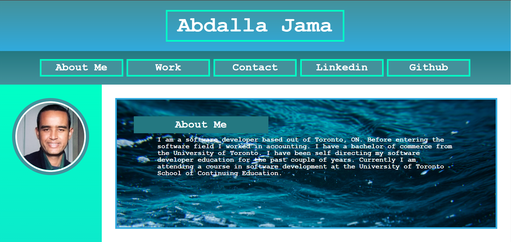

# Professional Portfolio

## Description

This project is a single webpage that is a portfolio of my work. The purpose of the webpage is to create a place to showcase my work as a web developer. The page highlights and organizes my work in addition to providing contact details and links.

## Table of Contents

- [Usage](#usage)
- [Credits](#credits)
- [License](#license)

## Usage

The website is live on the open web and can be accessed at https://abdallajama201.github.io/Challenge-02-Advanced-CSS/

A photo of the page is available below

## Credits

The photos in the webpage are provided by the free to use photo site https://www.pexels.com.

A generic css reset template is borrowed from https://www.codegrepper.com/code-examples/css/generic+css+reset+template

## License

This project is under the MIT License with language provided by the Open Source Initiative.
